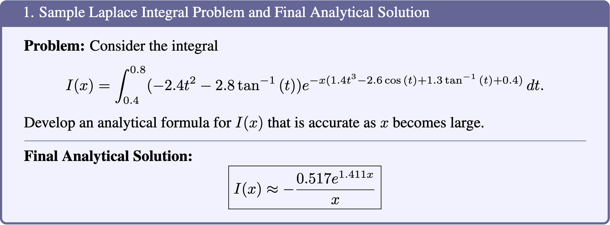

# HARDMath: A Benchmark Dataset for Challenging Problems in Applied Mathematics

This is the repository for HARDMath: A Benchmark Dataset for Challenging Problems in Applied Mathematics. 

**The updated paper is available here:** [MATHBench](https://github.com/sarahmart/HARDMath/blob/main/assets/HARDMath_revised_manuscript.pdf).

This repository hosts the [full dataset](./data/HARDMath.json) and the [evaluation dataset](./evaluation/data/eval_HARDMath.json), together with the generation and evaluation code described in the paper. The format of the data is detailed below.

### About HARDMath

Improving the mathematical reasoning capabilities of Large Language Models (LLMs) is of significant interest to the machine learning community. To rigorously track the progress of these models, comprehensive and diverse benchmarks are essential. However, most existing benchmarks focus on problems at the undergraduate level or below and often feature straightforward solutions. In contrast, many real-world problems in science and engineering do not follow this trend and require approximations or sophisticated techniques that current benchmarks fail to evaluate. Therefore, it is imperative to develop benchmarks with more challenging problems and emphasize a different style of mathematical reasoning.    

<p align="center">
     <br>
  An example of a difficult problem that does not have an exact solution but can be accurately approximated using techniques from applied mathematics.
</p>

To address this gap, we introduce **HARDMath**, a dataset of challenging, graduate-level problems in applied mathematics that can be used for language model evaluation. Unlike other popular mathematical datasets, HARDMath contains problems that require a combination of advanced problem-solving skills, approximation methods, and mathematical intuition. The dataset contains a large test set of 1,050 problems and a mini test set of 437 problems, divided across seven different problem types. A "Word Problem in Context" set is also introduced, which consists of 40 handwritten problems that require asymptotic reasoning in the context of plausible real-world scenarios. 

### Problem Types

| Problem Type    | Form |
| -------- | ------- |
| Nondimensionalization of symbolic polynomials  | $a_1 x^{n_1} + a_2 x^{n_2} + a_3, ~~ n_1 > n_2 > 0$    |
| Nondimensionalization of numerical polynomials | $\pm a_1 x^{n_1} \pm a_2 x^{n_2} \pm a_3, ~~ n_1 > n_2$     |
| Polynomial root-finding   | $\epsilon x^{n_1} \pm x^{n_2} \pm 1 $    |
| Polynomial root correction terms  | $x^*(\epsilon) = \overline{x}(\epsilon) + \delta$    |
| Nonlinear ordinary differential equations | $\frac{d^3y}{dx^3}=f(x)$     |
| Integrals   | $I(\epsilon) = \int_0^a \frac{1}{\epsilon + P(x)} \, dx$    |
| Laplace Integrals   | $I(x) = \int_a^b g(t) e^{\pm x f(t)} dt$    |


### Data Access
Our full datasets of problems and solutions are stored in the `data` directory. They are available in either CSV or JSON format.

### Dataset Format
In the CSV and JSON files containing our data, each problem stores the following information:
- **“question” (str):** the text containing the applied mathematics problem  
- **“solution” (str):** the text containing the worked solution and the boxed final solution  
- **“question_type” (str):** the category the problem/solution falls into (options include “integral,” “ODE,” “nondimensionalization_numeric,” etc.)  
- **“answer_type” (str):** the type of final solution to the applied mathematics problem (options include “math_expression” for problems that only contain one solution regime, and “list” for problems that contain two solution regimes)  
- **“extracted_answer” (str):** LaTeX expressions containing the final boxed solution, which is a list of expressions if there are multiple solution regimes, the expression itself if there is only one solution regime, or a float if the solution is a numerical value  
- **“small_eval_point” (float):** the $x$ value at which the numerical solutions and approximate solutions are evaluated for the “small” solution regime  
- **“small_analytical” (float):** the numerical value of the analytical solution evaluated at small_eval_point  
- **“small_numerical” (float):** the numerical value of the ground truth (numerical) solution evaluated at small_eval_point  
- **“large_eval_point” (float):** the $x$ value at which the numerical solutions and approximate solutions are evaluated for the “large” solution regime  
- **“large_analytical” (float):** the numerical value of the ground truth (numerical) solution evaluated at large_eval_point  
- **“large_numerical” (float):** the numerical value of the ground truth (numerical) solution evaluated at large_eval_point  

### Data Generation
To generate problems and their solutions, navigate to the `src` directory and choose the type of problem you would like to generate. Running the `[problem_type]_generator.ipynb` Jupyter notebook will generate $n$ problems and their solutions, and save the results in a .csv file. The number of problems can be set by the variable `num_problems` near the top of each notebook.

### Evaluation

#### Getting Started 

First, clone the repository to your local machine:

```bash
git clone https://github.com/sarahmart/HARDMath.git
```

Navigate into the cloned directory:

```bash
cd HARDMath/evaluation
```

#### Prerequisites

The repository includes a `requirements.yml` file to set up a Conda environment with all necessary dependencies. To create the environment, run:

```bash
conda env create -f requirements.yml
```

After the environment is created, activate it with:

```bash
conda activate hardmath-env
```

This will install all required packages and dependencies and the custom modules needed to run the scripts.


#### How to Run

To run the script, use the following command:

```bash
python script_name.py --data_dir <path_to_data> --input_file <input_file_name> --example_file <example_file_name> --output_dir <output_directory> --output_file <output_file_name> --model <model_name> --grader <grader_name> --key <api_key> --question_type <question_type> --temperature <temperature_value> --server_ip <server_ip_address>
```

Example command:

```bash
python script_name.py --data_dir data --input_file eval_HARDMath.json --example_file example_HARDMath_1shot.json --output_dir results/test --output_file nondimensionalization_symbolic_0shot_gpt4.json --model gpt-3.5-turbo --grader gpt-4o --key YOUR_API_KEY --question_type nondimensionalization_symbolic --temperature 0.0 
```

##### Command-Line Flags

- `--data_dir`: Directory where your input files are located. Default is `data`.
- `--input_file`: The main input data file (e.g., `eval_HARDMath.json`). Default is `eval_HARDMath.json`.
- `--example_file`: Example data file for one-shot learning (e.g., `example_HARDMath_1shot.json`). Default is `examples_HARDMath_1shot.json`.
- `--output_dir`: Directory where the results will be saved. Default is `results/test`.
- `--output_file`: Name of the output file (e.g., `nondimensionalization_symbolic_1shot_gpt4.json`). Default is `nondimensionalization_symbolic_1shot_gpt4.json`.
- `--model`: The model to use for generating responses. Choices include `gpt-4-turbo`, `gpt-3.5-turbo`, `gpt-4o`, `llama3-8b`, `codellama-13b`. Default is `gpt-3.5-turbo`.
- `--grader`: The model to use for grading responses. Choices include `gpt-4-turbo`, `gpt-4o`. Default is `gpt-4o`.
- `--key`: Your API key for the model (if using OpenAI's GPT models). If not provided, the script will attempt to load it from the environment variable `OPENAI_API_KEY`.
- `--prompt_file`: (Optional) Path to a file containing custom prompts. If not provided, the script will create new prompts.
- `--shot_num`: Number of examples to use for few-shot learning. Default is `0`.
- `--question_type`: The type of mathematical problems being evaluated. Choices include `nondimensionalization_symbolic`, `nondimensionalization_numeric`, `integral`, `ode`, `polynomial_roots`. Default is `nondimensionalization_symbolic`.
- `--integral_subtype`: (Optional) Subtype of integral problems (if applicable). Choices include `traditional` and `laplace`.
- `--temperature`: Controls the creativity of the model's responses. Lower values make the model more deterministic. Default is `0.0`.
- `--server_ip`: IP address of the server if using a local model server (e.g., Ollama Server).

##### Output

The results will be saved in the specified output directory and file. The output JSON file will contain the prompts, model responses, extracted answers, and comparison scores.

##### Troubleshooting

If you encounter any issues while running the script, ensure that:

1. The input files are correctly formatted JSON files.
2. The custom modules (`utils`, `create_prompt`, `models`, `answer_extraction`) are properly set up.
3. Your API key is correctly provided if using GPT models from OpenAI.

For more detailed debugging, check the error messages printed during the script execution.
